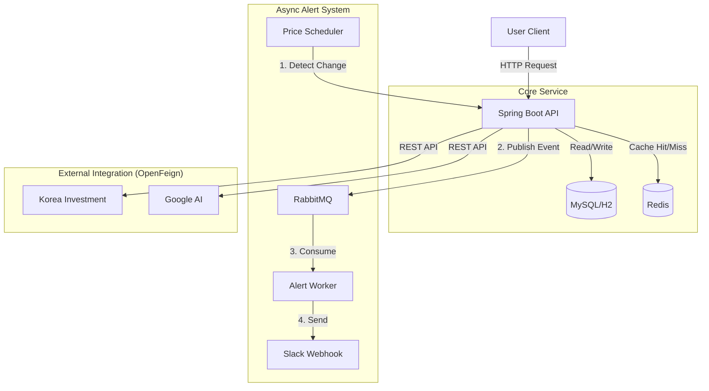
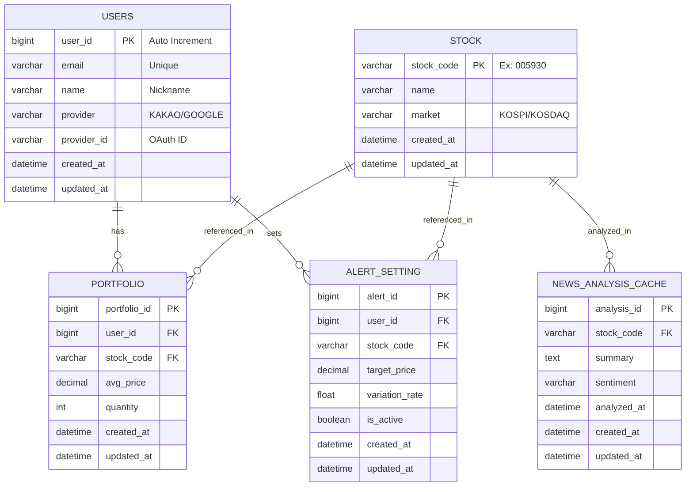

## StockInsight: AI 기반 주식 자산 관리 & 스마트 알림 서비스

> **"흩어진 자산을 한눈에, 변동성은 즉각적으로."**
>
>
> 대용량 트래픽 상황에서도 안정적인 **비동기 알림 시스템**과 **외부 API 연동 최적화**를 목표로 설계된 백엔드 프로젝트입니다.
>

---

## 시스템 아키텍처 (System Architecture)

이 프로젝트는 트래픽 제어(RabbitMQ)와 조회 성능 최적화(Redis)를 핵심으로 설계

---

## 데이터베이스 설계 (ERD)

효율적인 데이터 관리를 위해 정규화된 스키마를 사용

---

## 기술 스택 (Tech Stack)

| **구분** | **기술** | **버전/선정 이유** |
| --- | --- | --- |
| **Language** | **Java 21** | 최신 LTS, Virtual Thread 지원 |
| **Framework** | **Spring Boot 3.4.2** | 안정적인 버전  |
| **DB** | **H2** (개발용) / **MySQL** (운영용) | 표준 RDBMS |
| **Cache** | **Redis** | 조회 성능 가속 및 API 제한 극복 |
| **Messaging** | **RabbitMQ** | 트래픽 폭주 제어  |
| **Client** | **Spring Cloud OpenFeign** | 외부 API 통신 생산성 향상 |
| **Build** | Gradle | 의존성 관리 |

---

## 개발 로드맵 (Roadmap)

- [ ]  **Phase 1: Project Init**
    - [ ]  프로젝트 생성 및 환경 설정
    - [ ]  H2 DB 연동 및 Entity 설계
    - [ ]  GitHub Repository 연동
- [ ]  **Phase 2: Core Features**
    - [ ]  Kakao OAuth 2.0 로그인
    - [ ]  한국투자증권 API 연동 (OpenFeign)
    - [ ]  포트폴리오 CRUD 및 수익률 계산
- [ ]  **Phase 3: Async & Performance**
    - [ ]  Redis 캐싱 적용 (시세 조회)
    - [ ]  RabbitMQ 알림 시스템 구축
    - [ ]  스케줄러 구현 (변동 감지)
- [ ]  **Phase 4: AI Integration**
    - [ ]  Google Gemini API 연동 (뉴스 요약)
    - [ ]  Slack Webhook 연동